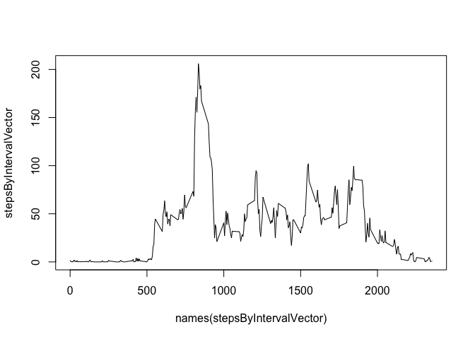
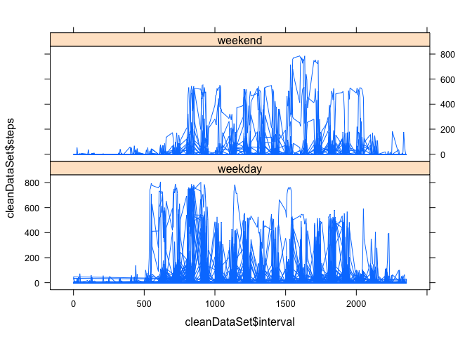

# Reproducible Research: Peer Assessment 1


## Loading and preprocessing the data
Load necessary library files and data

```r
library(lattice)
activityData <- read.csv("activity.csv", stringsAsFactors = FALSE)
```

Summary of raw data


```r
summary(activityData)
```

```
##      steps            date              interval     
##  Min.   :  0.00   Length:17568       Min.   :   0.0  
##  1st Qu.:  0.00   Class :character   1st Qu.: 588.8  
##  Median :  0.00   Mode  :character   Median :1177.5  
##  Mean   : 37.38                      Mean   :1177.5  
##  3rd Qu.: 12.00                      3rd Qu.:1766.2  
##  Max.   :806.00                      Max.   :2355.0  
##  NA's   :2304
```


## What is mean total number of steps taken per day?
Load necessary library files and data

```r
library(lattice)
activityData <- read.csv("activity.csv", stringsAsFactors = FALSE)
```

Summary of raw data


```r
summary(activityData)
```

```
##      steps            date              interval     
##  Min.   :  0.00   Length:17568       Min.   :   0.0  
##  1st Qu.:  0.00   Class :character   1st Qu.: 588.8  
##  Median :  0.00   Mode  :character   Median :1177.5  
##  Mean   : 37.38                      Mean   :1177.5  
##  3rd Qu.: 12.00                      3rd Qu.:1766.2  
##  Max.   :806.00                      Max.   :2355.0  
##  NA's   :2304
```


## What is the average daily activity pattern?
calculate the average number of steps taken each interval by utiliaing lapply and split functions
break list returned by lapply into a vector to plot a time series


```r
stepsByInterval <- lapply(split(activityData$steps, activityData$interval),mean, na.rm=TRUE)
stepsByIntervalVector <- unlist(stepsByInterval)
plot(names(stepsByIntervalVector), stepsByIntervalVector, type="l")
```

 

determine which 5 min interval contains the highest number of steps


###The interval with the highest average steps is 835


## Imputing missing values
calculate the average number of steps taken each interval by utiliaing lapply and split functions
break list returned by lapply into a vector to plot a time series


```r
stepsByInterval <- lapply(split(activityData$steps, activityData$interval),mean, na.rm=TRUE)
stepsByIntervalVector <- unlist(stepsByInterval)
plot(names(stepsByIntervalVector), stepsByIntervalVector, type="l")
```

 

determine which 5 min interval contains the highest number of steps


###The interval with the highest average steps is 835

## Are there differences in activity patterns between weekdays and weekends?

```r
#copy activityData to cleanDataSet
cleanDataSet = activityData

#create POSIXt variable 
cleanDataSet$dtfmt <- strptime(cleanDataSet$date,"%Y-%m-%d")


#create day-of-week factor variable
cleanDataSet$dow <- factor(c("weekend"), levels = c("weekday", "weekend"))

#populate day of week 
for(x in 1:nrow(cleanDataSet)){
        if (weekdays(cleanDataSet[x,4], abbreviate = TRUE) == "Sat" || weekdays(cleanDataSet[x,4],abbreviate = TRUE) == "Sun")
                cleanDataSet[x,5] <- "weekend"
         else
                cleanDataSet[x,5] <- "weekday"
}

#plot timeseries weekend vs. weekday
xyplot(cleanDataSet$steps ~ cleanDataSet$interval | cleanDataSet$dow, layout = c( 1, 2), type = c("l", "l"))
```

 
