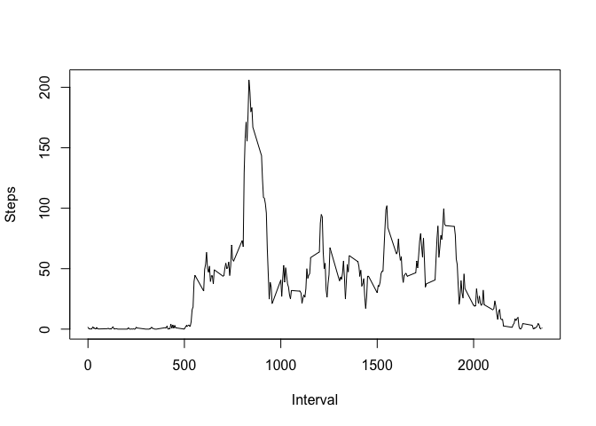

# Reproducible Research: Peer Assessment 1
Neil Caren
 
###Loading and Processing Data

Load necessary library files and data

```r
library(lattice)
activityData <- read.csv("activity.csv", stringsAsFactors = FALSE)
```

Summary of raw data


```r
summary(activityData)
```

```
##      steps            date              interval     
##  Min.   :  0.00   Length:17568       Min.   :   0.0  
##  1st Qu.:  0.00   Class :character   1st Qu.: 588.8  
##  Median :  0.00   Mode  :character   Median :1177.5  
##  Mean   : 37.38                      Mean   :1177.5  
##  3rd Qu.: 12.00                      3rd Qu.:1766.2  
##  Max.   :806.00                      Max.   :2355.0  
##  NA's   :2304
```
####What is the mean total number of steps taken per day ?
Calculate the total number of steps taken eacch day by utiliaing lapply and split functions
break list returned by lapply into a vector to plot


```r
totalStepsByDate <- lapply(split(activityData$steps, activityData$date),sum)
totalStepsByDateVector <- unlist(totalStepsByDate)
```

Plot a histogram of Steps to get a sense of frequency and distribution.  Also added a rug for further clarity


```r
hist(totalStepsByDateVector)
rug(totalStepsByDateVector)
```

 

Calculate and report the mean and median of the total number of steps taken per day


```r
stepsMean <- prettyNum(round(mean(totalStepsByDateVector, na.rm=TRUE),2))
stepsMedian <- prettyNum(round(median(totalStepsByDateVector, na.rm = TRUE),2))
```

The mean number of steps per day = 10766.19 and the mediam = 10765


###What is the average daily activity pattern?

calculate the average number of steps taken each interval by utiliaing lapply and split functions
break list returned by lapply into a vector to plot a time series


```r
stepsByInterval <- lapply(split(activityData$steps, activityData$interval),mean, na.rm=TRUE)
stepsByIntervalVector <- unlist(stepsByInterval)
plot(names(stepsByIntervalVector), stepsByIntervalVector, type="l")
```

 

determine which 5 min interval contains the highest number of steps


###The interval with the highest average steps is 835


###Inputting missing values
The strategy used to populate missing data was to utilize the average steps for the missings data interval across all the days  ( see commented code below)


```r
#copy activityData to cleanDataSet
cleanDataSet = activityData
#create a vector of NAs from activityData
vectorOfNAs <- activityData[(is.na(activityData$steps)),]

#loop through vectorOfNAs and use row name to update cleanDataSwt with average steps for that interval 
for (x in  1:nrow(vectorOfNAs)) {
        index = row.names(vectorOfNAs[x,])
        y <- as.character(vectorOfNAs[x,3])
        cleanDataSet[index,1] <- stepsByIntervalVector[y]
}
totNAs <- nrow(vectorOfNAs)
```


####The total number of NAs is 2304


Show summaries of before and after datasets to see change


```r
summary(activityData)
```

```
##      steps            date              interval     
##  Min.   :  0.00   Length:17568       Min.   :   0.0  
##  1st Qu.:  0.00   Class :character   1st Qu.: 588.8  
##  Median :  0.00   Mode  :character   Median :1177.5  
##  Mean   : 37.38                      Mean   :1177.5  
##  3rd Qu.: 12.00                      3rd Qu.:1766.2  
##  Max.   :806.00                      Max.   :2355.0  
##  NA's   :2304
```

```r
summary(cleanDataSet)
```

```
##      steps            date              interval     
##  Min.   :  0.00   Length:17568       Min.   :   0.0  
##  1st Qu.:  0.00   Class :character   1st Qu.: 588.8  
##  Median :  0.00   Mode  :character   Median :1177.5  
##  Mean   : 37.38                      Mean   :1177.5  
##  3rd Qu.: 27.00                      3rd Qu.:1766.2  
##  Max.   :806.00                      Max.   :2355.0
```


calculate the total number of steps taken eacch day by utiliaing lapply and split functions
break list returned by lapply into a vector to plot


```r
totalStepsByDate <- lapply(split(cleanDataSet$steps, cleanDataSet$date),sum)
totalStepsByDateVector <- unlist(totalStepsByDate)
```

Plot a histogram of Steps to get a sense of frequency.  Also added a rug for further clarity


```r
hist(totalStepsByDateVector)
rug(totalStepsByDateVector)
```

 


calculate the average number of steps taken each interval by utiliaing lapply and split functions
break list returned by lapply into a vector to plot a time series


```r
stepsByInterval <- lapply(split(cleanDataSet$steps, cleanDataSet$interval),mean, na.rm=TRUE)
stepsByIntervalVector <- unlist(stepsByInterval)
#plot(names(stepsByIntervalVector), stepsByIntervalVector, type="l")
```


```r
stepsMean <- prettyNum(round(mean(totalStepsByDateVector),2))
stepsMedian <- prettyNum(round(median(totalStepsByDateVector),2))
```

####The mean number of steps per day = 10766.19 and the mediam = 10766.19

####The interval with the highest average steps is 835

###I  don't see any difference when filling in NAs mostly due to using exising averages as replacement values


###Are there differences in activity patterns between weekdays and weekends?


```r
#create POSIXt variable 
cleanDataSet$dtfmt <- strptime(cleanDataSet$date,"%Y-%m-%d")
#create day-of-week factor variable
cleanDataSet$dow <- factor(c("weekend"), levels = c("weekday", "weekend"))

#populate day of week 
for(x in 1:nrow(cleanDataSet)){
        if (weekdays(cleanDataSet[x,4], abbreviate = TRUE) == "Sat" || weekdays(cleanDataSet[x,4],abbreviate = TRUE) == "Sun")
                cleanDataSet[x,5] <- "weekend"
         else
                cleanDataSet[x,5] <- "weekday"
}

#plot timeseries weekend vs. weekday
xyplot(cleanDataSet$steps ~ cleanDataSet$interval | cleanDataSet$dow, layout = c( 1, 2), type = c("l", "l"))
```

 

####On Weekdays the intervals earlier in the day have higher steps count when compared to the weekend.  THis woud be expected due to work schedules
